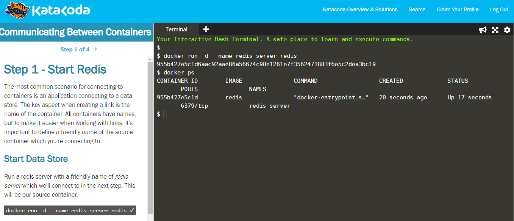
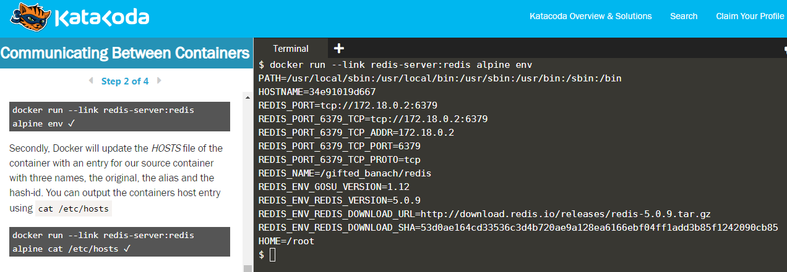
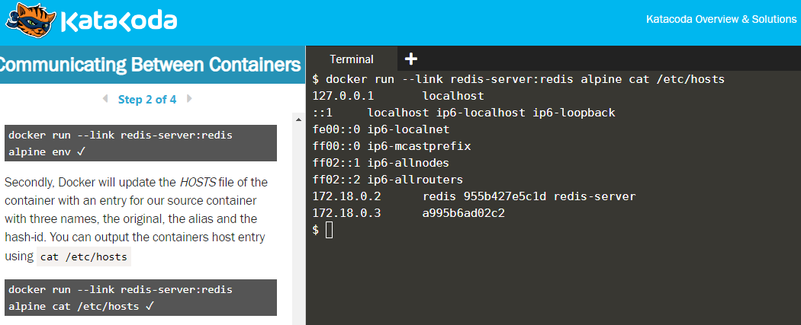
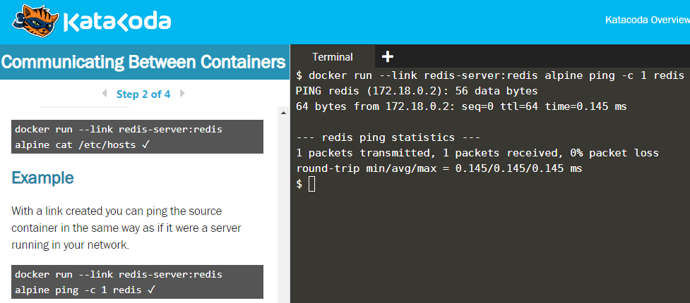
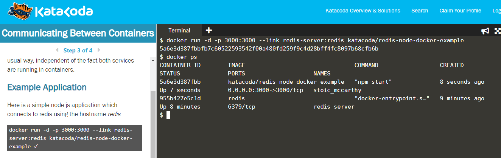
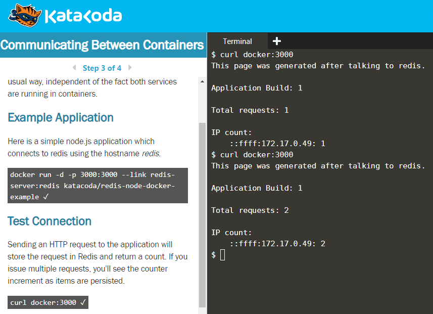
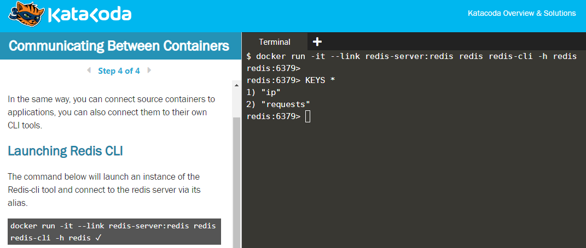

## Communication between containers - Linking different containers

**Aim:** Connect a container with a data store, here Redis and setup communication link between them.

**1. Start the Redis container with name "redis-server"**

```
$ docker run -d --name redis-server redis
```



**2. Start the second container and link it with the first container on startup**

**Syntax:** ```$ docker run --link [container name/id]:[alias] [image for container 2]```

**Note: alias is a name which is used to easily organize and manage the linked container rather than remembering its full name or ID because full name can be long as it must be meaningful in a large cluster.**

**Note: The above command runs but gives no output because we did not start the second container in interactive mode and also did not added a command to be executed.**

### Generic commands to be executed on linking of second container

**2.1) See the environment variables after the linking of containers***

```
$ docker run --link redis-server:redis alpine env
```



**2.2) See the IP address and other connection methods using hosts/ file**

```
$ docker run --link redis-server:redis alpine cat /etc/hosts
```



**2.3) Ping the linked container**

```
$ docker run --link redis-server:redis alpine ping -c 1 redis
```



**3) Link the redis container to a NodeJS application running on localhost at port 3000**

```
$ docker run -d -p 3000:3000 --link redis-server:redis katacoda/redis-node-docker-example
```



**Ping the localhost for response. On each curl, the redis key value increments by 1.**

```
$ curl docker:3000
```



**4) Launch another Redis container with Redis command line interface in interactive mode**

```
$ docker run -it --link redis-server:redis redis redis-cli -h redis
```

**Execute the following command:** ```$ KEYS *```



## References

[Katacoda Scenario](https://www.katacoda.com/courses/docker/5)
