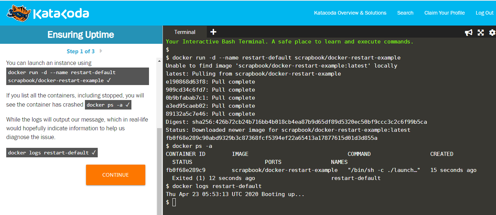
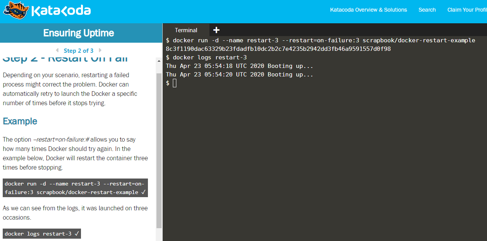
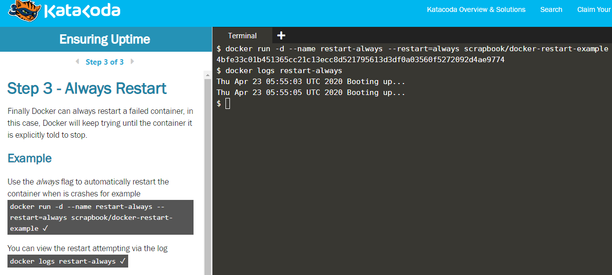

## Ensuring Container Uptime - Restart Policy

* Docker containers return an exit code when they change their state from **running**.

* A non-zero exit code means that the container has crashed. All crashed containers remain in **stopped mode**

To view all the containers, including stopped ones, use the following command:

```
$ docker ps -a
```

* To view the log files of the crashed container, use the following command:

```
$ docker logs [container name or ID]
```



**Note: Most crashes are generic and can be easily fixed by relaunching the container. Thus, it is a good practise to create a restart policy on failure of the container**

**Restart Policy on Failure**

```
$ docker run --restart=on-failure:[Number of times to restart] [docker image]
```



**Restart Policy - always restart on crash**

```
$ docker run --restart=always [image name]
```



## References

[KataCoda Scenarios](https://katacoda.com/courses/docker/9)
