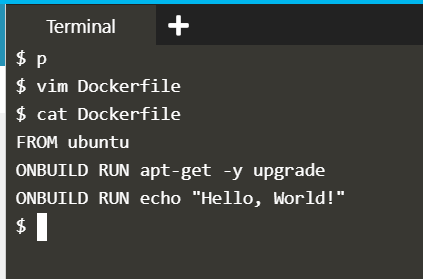

## Optimizing Dockerfiles with OnBuild

### Experiment

While Dockerfile's are executed in order from top to bottom, you can trigger an instruction to be executed at a later time when the image is used as the base for another image.

* Write Dockerfile for first image with Onbuild command

```dockerfile
FROM ubuntu
ONBUILD RUN apt-get -y upgrade
ONBUILD RUN echo "Hello, World!"
```

* Create an image using above Dockerfile, the onbuild command won't execute.

```
$ docker build -t firstimage .
```

* Write Dockerfile for second image using first image as base image

```dockerfile
FROM firstimage
```

* Create Docker image for second Dockerfile

```
$ docker build -t secondimage .
```

The result is that we can build this image but the application specific commands won't be executed until the built image is used as a base image. They'll then be executed as part of the base image's build.

### Outputs




## References

[KataCoda Scenario](https://www.katacoda.com/courses/docker/4)
