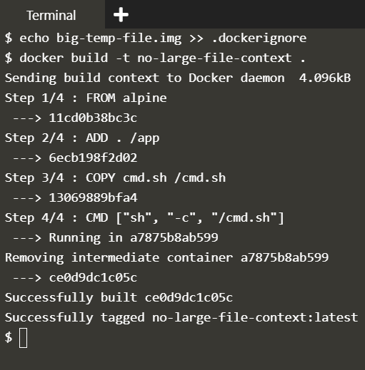

## Ignoring files on Docker Build

Ignore certain files from ending up inside a Docker image that can introduce security risks. This scenario also investigates how you can reduce the build time by ignoring which files are sent to the Docker Build Context.

### Two important cases

**1. Private Data should not be sent to Docker Image**

* Example: A Dockerfile that copies entire working directory to the docker image.

```dockerfile
FROM alpine
ADD . /app
COPY cmd.sh /cmd.sh
CMD ["sh", "-c", "/cmd.sh"]
```

```
$ docker build -t password .
$ docker run password ls /app
```


The .dockerignore file would be stored in source control and share with the team to ensure that everyone is consistent.

The ignore file supports directories and Regular expressions to define the restrictions, very similar to .gitignore

```
$ echo password.txt >> .dockerignore
$ docker build -t nopass .
$ docker run nopass ls /app
```


**Note:** If you need to use the passwords as part of a RUN command then you need to copy, execute and delete the files as part of a single RUN command. Only the final state of the Docker container is persisted inside the image.

**2. Improving Docker Build time by removing large files from Docker Build Context**

**Breaking Concepts Deep:** Irrespective of the fact that Dockerfile uses any file or not, Docker engine sends all the files in the directory of Dockerfile to the remote Docker Server as Docker Build context. The speed of the build can be vastly improved by ignoring all the files that are of no use to the dockerfile.


**Ignoring large files from working directory**



## References

[KataCoda Scenario](https://www.katacoda.com/courses/docker/12)
