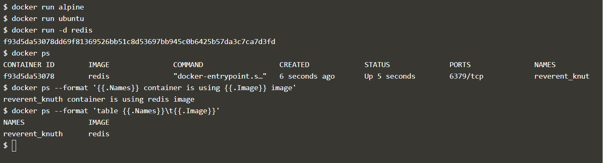
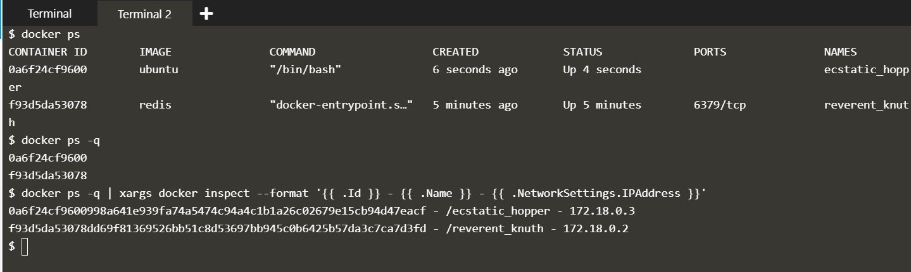

## Formatting PS Output

Using the **--format** parameter with **Golang** specific syntax template.

### Formatting docker ps command

```
$ docker run -d redis
$ docker ps
$ docker ps --format '{{.Names}} container is using {{.Image}} image'
$ docker ps --format 'table {{.Names}}\t{{.Image}}'
```



### Listing IP Address by formatting Docker Inspect command

```
$ docker ps -q | xargs docker inspect --format '{{ .Id }} - {{ .Name }} - {{ .NetworkSettings.IPAddress }}'
```



## References

[KataCoda Experiments](https://www.katacoda.com/courses/docker/formatting-ps-output)
