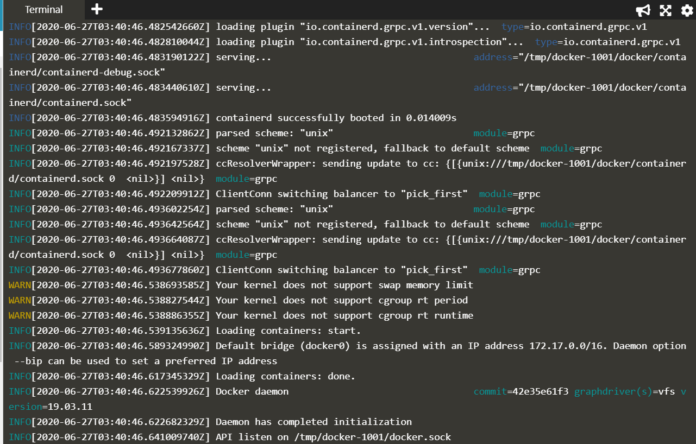

## Rootless Docker

With Docker all the containers are managed via the Docker Daemon. The Daemon controls all aspects of the container lifecycle.

Previous versions of Docker required that the Daemon started by user with root privileges. This required giving users full access to a machine in order to control and configure Docker. As a result, this exposed potential security risks.

Rootless Docker is a project from Docker that removes the requirement for the Docker Daemon to be started by a root. This creates a more secure environment.

Start with logged in as root. The first step is to create a new user without these root privileges, meaning they will be running with increased security and not be able to make critical changes to the system.

```
$ useradd -m -d /home/lowprivuser -p $(openssl passwd -1 password) lowprivuser
$ sudo su lowprivuser
$ touch /root/blocked # Not having all permissions
$ docker ps # Needs root priviliges
```


### Installin Rootless Docker for a user

```
$ curl -sSL https://get.docker.com/rootless | sh
```


### Initialize Docker Daemon for current user

```
$ export XDG_RUNTIME_DIR=/tmp/docker-1001
$ export PATH=/home/lowprivuser/bin:$PATH
$ export DOCKER_HOST=unix:///tmp/docker-1001/docker.sock
$ /home/lowprivuser/bin/dockerd-rootless.sh --experimental --storage-driver vfs
```




* The daemon runs in foreground and we need new terminal to run docker commands

* Add the environment variables again if refresh buffer released them

```
export XDG_RUNTIME_DIR=/tmp/docker-1001
export PATH=/home/lowprivuser/bin:$PATH
export DOCKER_HOST=unix:///tmp/docker-1001/docker.sock
```

* Note that 1001 is the default user ID used here. If the command does not work, get the user id and replace it in the script.

### Running Docker commands

```
$ docker ps
$ docker run -it ubuntu
```


```
$ docker info
```


Users within the container will still be reported as root. They will be able to install packages and modify parts of the system running inside of the Docker. However, if they managed to break out they wouldn't be able to interfer with the host.

as root it's possible to explore which processes are running and which user started them. Using ps aux you can verify that our new container instance is managed and owned by our low privileged user.

```
$ id
$ sudo su
$ id; ps aux | grep lowprivuser
```


## References

[KataCoda Experiments](https://www.katacoda.com/courses/docker/rootless)

[Rootless Docker Blog](https://www.docker.com/blog/experimenting-with-rootless-docker/)
