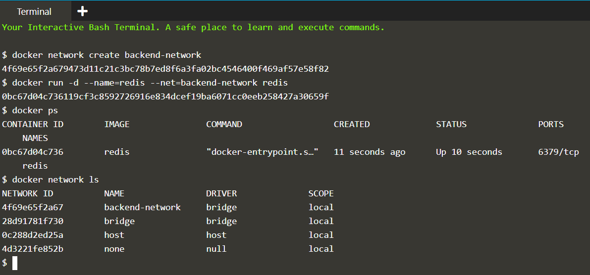

# Docker Networks

Create a docker network allowing containers to communicate. Also, focus on Embedded DNS Server added in Docker 1.10.

Docker has two approaches to networking. The first defines a link between two containers. This link updates /etc/hosts and environment variables to allow containers to discover and communicate.

The alternate approach is to create a docker network that containers are connected to. The network has similar attributes to a physical network, allowing containers to come and go more freely than when using links.

### Step 1) Create Networks

* Create a network

```
$ docker network create [network name]
$ docker network ls
```

**Note: Default driver is bridge and scope is local**

* Assign network to container while launching them

```
$ docker run --name=[container name] --net=[network name] [container image]
```

* For example, let's create a **backend-network** with **redis container**.

```
$ docker network create backend-network
$ docker run -d --name==redis --net=backend-network redis
```



### Step 2) Network Communication

Unlike using links, docker network behave like traditional networks where nodes can be attached/detached.

Explore using the following two commands and you'll notice it no longer mentions other containers.

```
$ docker run --net=backend-network alpine env
$ docker run --net=backend-network alpine cat /etc/hosts
```

Instead, the way containers can communicate via an Embedded DNS Server in Docker. This DNS server is assigned to all containers via the IP 127.0.0.11 and set in the resolv.conf file.

```
$ docker run --net=backend-network alpine cat /etc/resolv.conf
```

When containers attempt to access other containers via a well-known name, such as Redis, the DNS server will return the IP address of the correct Container. In this case, the fully qualified name of Redis will be redis.backend-network.

```
$ docker run --net=backend-network alpine ping -c1 redis
```


### Step 3) Connect Containers in network

### Step 4) Create Aliases

### Step 5) Disconnect Networks

## References

[Katacoda Scenario](https://www.katacoda.com/courses/docker/networking-intro)
