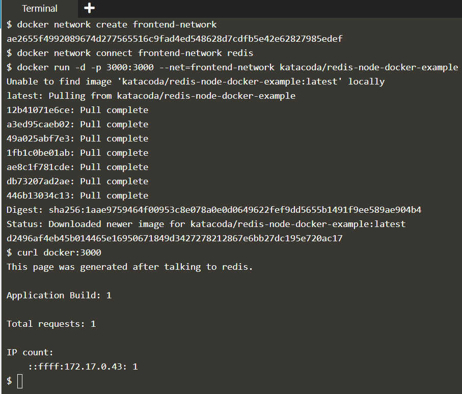

# Docker Networks

Create a docker network allowing containers to communicate. Also, focus on Embedded DNS Server added in Docker 1.10.

Docker has two approaches to networking. The first defines a link between two containers. This link updates /etc/hosts and environment variables to allow containers to discover and communicate.

The alternate approach is to create a docker network that containers are connected to. The network has similar attributes to a physical network, allowing containers to come and go more freely than when using links.

### Step 1) Create Networks

* Create a network

```
$ docker network create [network name]
$ docker network ls
```

**Note: Default driver is bridge and scope is local**

* Assign network to container while launching them

```
$ docker run --name=[container name] --net=[network name] [container image]
```

* For example, let's create a **backend-network** with **redis container**.

```
$ docker network create backend-network
$ docker run -d --name==redis --net=backend-network redis
```


### Step 2) Network Communication

Unlike using links, docker network behave like traditional networks where nodes can be attached/detached.

Explore using the following two commands and you'll notice it no longer mentions other containers.

```
$ docker run --net=backend-network alpine env
$ docker run --net=backend-network alpine cat /etc/hosts
```

Instead, the way containers can communicate via an Embedded DNS Server in Docker. This DNS server is assigned to all containers via the IP 127.0.0.11 and set in the resolv.conf file.

```
$ docker run --net=backend-network alpine cat /etc/resolv.conf
```

When containers attempt to access other containers via a well-known name, such as Redis, the DNS server will return the IP address of the correct Container. In this case, the fully qualified name of Redis will be redis.backend-network.

```
$ docker run --net=backend-network alpine ping -c1 redis
```


### Step 3) Connect Containers in network

Docker supports multiple networks and containers being attached to more than one network at a time.

For example, let's create a separate network with a Node.js application that communicates with our existing Redis instance.

```
$ docker network create frontend-network
```

When using the **connect** command it is possible to attach existing containers to the network.

```
# docker network connect [network name] [container name]
$ docker network connect frontend-network redis
```

When we launch the web server, given it's attached to the same network it will be able to communicate with our Redis instance.

```
$ docker run -d -p 3000:3000 --net=frontend-network katacoda/redis-node-docker-example
```

You can test it using `curl docker:3000`



### Step 4) Create Aliases

Links are still supported when using docker network and provide a way to define an Alias to the container name. This will give the container an extra DNS entry name and way to be discovered. When using --link the embedded DNS will guarantee that localised lookup result only on that container where the --link is used.

The other approach is to provide an alias when connecting a container to a network.

The following command will connect our Redis instance to the frontend-network with the alias of db.

```
$ docker network create frontend-network2
$ docker network connect --alias db frontend-network2 redis
```

When containers attempt to access a service via the name db, they will be given the IP address of our Redis container.

```
$ docker run --net=frontend-network2 alpine ping -c1 db
```


### Step 5) Disconnect Networks


## References

[Katacoda Scenario](https://www.katacoda.com/courses/docker/networking-intro)
