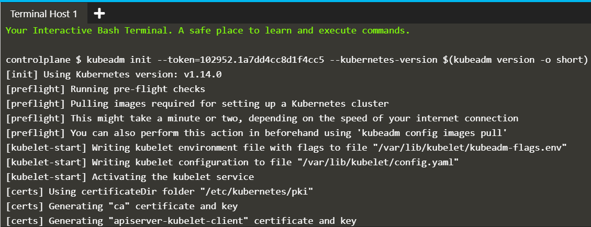

## Introduction to KubeADM and launching multi node clusters

### 1) Initialize the Master

The first stage of initialising the cluster is to launch the master node. The master is responsible for running the control plane components, etcd and the API server. Clients will communicate to the API to schedule workloads and manage the state of the cluster.

The command below will initialise the cluster with a known token to simplify the following steps.

```
$ kubeadm init --token=102952.1a7dd4cc8d1f4cc5 --kubernetes-version $(kubeadm version -o short)
```

In production, it's recommend to exclude the token causing kubeadm to generate one on your behalf.

To manage the Kubernetes cluster, the client configuration and certificates are required. This configuration is created when kubeadm initialises the cluster. The command copies the configuration to the users home directory and sets the environment variable for use with the CLI.

```
sudo cp /etc/kubernetes/admin.conf $HOME/
sudo chown $(id -u):$(id -g) $HOME/admin.conf
export KUBECONFIG=$HOME/admin.conf
```




### 2) Deploy Container Networking Interface (CNI)

The Container Network Interface (CNI) defines how the different nodes and their workloads should communicate. There are multiple network providers available, some are listed on https://kubernetes.io/docs/concepts/cluster-administration/addons/

Here, we use **Weave-Works**. Create **/opt/weave-kube** file

```yml
apiVersion: v1
kind: List
items:
  - apiVersion: v1
    kind: ServiceAccount
    metadata:
      name: weave-net
      labels:
        name: weave-net
      namespace: kube-system
  - apiVersion: rbac.authorization.k8s.io/v1beta1
    kind: ClusterRole
    metadata:
      name: weave-net
      labels:
        name: weave-net
    rules:
      - apiGroups:
          - ''
        resources:
          - pods
          - namespaces
          - nodes
        verbs:
          - get
          - list
          - watch
      - apiGroups:
          - extensions
        resources:
          - networkpolicies
        verbs:
          - get
          - list
          - watch
      - apiGroups:
          - 'networking.k8s.io'
        resources:
          - networkpolicies
        verbs:
          - get
          - list
          - watch
      - apiGroups:
        - ''
        resources:
        - nodes/status
        verbs:
        - patch
        - update
  - apiVersion: rbac.authorization.k8s.io/v1beta1
    kind: ClusterRoleBinding
    metadata:
      name: weave-net
      labels:
        name: weave-net
    roleRef:
      kind: ClusterRole
      name: weave-net
      apiGroup: rbac.authorization.k8s.io
    subjects:
      - kind: ServiceAccount
        name: weave-net
        namespace: kube-system
  - apiVersion: rbac.authorization.k8s.io/v1beta1
    kind: Role
    metadata:
      name: weave-net
      namespace: kube-system
      labels:
        name: weave-net
    rules:
      - apiGroups:
          - ''
        resources:
          - configmaps
        resourceNames:
          - weave-net
        verbs:
          - get
          - update
      - apiGroups:
          - ''
        resources:
          - configmaps
        verbs:
          - create
  - apiVersion: rbac.authorization.k8s.io/v1beta1
    kind: RoleBinding
    metadata:
      name: weave-net
      namespace: kube-system
      labels:
        name: weave-net
    roleRef:
      kind: Role
      name: weave-net
      apiGroup: rbac.authorization.k8s.io
    subjects:
      - kind: ServiceAccount
        name: weave-net
        namespace: kube-system
  - apiVersion: extensions/v1beta1
    kind: DaemonSet
    metadata:
      name: weave-net
      labels:
        name: weave-net
      namespace: kube-system
    spec:
      # Wait 5 seconds to let pod connect before rolling next pod
      minReadySeconds: 5
      template:
        metadata:
          labels:
            name: weave-net
        spec:
          containers:
            - name: weave
              command:
                - /home/weave/launch.sh
              env:
                - name: HOSTNAME
                  valueFrom:
                    fieldRef:
                      apiVersion: v1
                      fieldPath: spec.nodeName
              image: 'weaveworks/weave-kube:2.5.1'
              imagePullPolicy: Always
              readinessProbe:
                httpGet:
                  host: 127.0.0.1
                  path: /status
                  port: 6784
              resources:
                requests:
                  cpu: 10m
              securityContext:
                privileged: true
              volumeMounts:
                - name: weavedb
                  mountPath: /weavedb
                - name: cni-bin
                  mountPath: /host/opt
                - name: cni-bin2
                  mountPath: /host/home
                - name: cni-conf
                  mountPath: /host/etc
                - name: dbus
                  mountPath: /host/var/lib/dbus
                - name: lib-modules
                  mountPath: /lib/modules
                - name: xtables-lock
                  mountPath: /run/xtables.lock
                  readOnly: false
            - name: weave-npc
              env:
                - name: HOSTNAME
                  valueFrom:
                    fieldRef:
                      apiVersion: v1
                      fieldPath: spec.nodeName
              image: 'weaveworks/weave-npc:2.5.1'
              imagePullPolicy: Always
#npc-args
              resources:
                requests:
                  cpu: 10m
              securityContext:
                privileged: true
              volumeMounts:
                - name: xtables-lock
                  mountPath: /run/xtables.lock
                  readOnly: false
          hostNetwork: true
          hostPID: true
          restartPolicy: Always
          securityContext:
            seLinuxOptions: {}
          serviceAccountName: weave-net
          tolerations:
            - effect: NoSchedule
              operator: Exists
          volumes:
            - name: weavedb
              hostPath:
                path: /var/lib/weave
            - name: cni-bin
              hostPath:
                path: /opt
            - name: cni-bin2
              hostPath:
                path: /home
            - name: cni-conf
              hostPath:
                path: /etc
            - name: dbus
              hostPath:
                path: /var/lib/dbus
            - name: lib-modules
              hostPath:
                path: /lib/modules
            - name: xtables-lock
              hostPath:
                path: /run/xtables.lock
                type: FileOrCreate
      updateStrategy:
        type: RollingUpdate
```

* Deploy Weave-Works CNI

```
$ kubectl apply -f /opt/weavekube
```

Weave will now deploy as a series of Pods on the cluster. The status of this can be viewed using the command `$ kubectl get pod -n kube-system`

When installing Weave on your cluster, visit https://www.weave.works/docs/net/latest/kube-addon/ for details.


### 3) Join Cluster

Once the Master and CNI has initialised, additional nodes can join the cluster as long as they have the correct token. The tokens can be managed via kubeadm token:

```
$ kubeadm token list
```

* On the Client Node:

```$ kubeadm join --discovery-token-unsafe-skip-ca-verification --token=102952.1a7dd4cc8d1f4cc5 172.17.0.8:6443```

The --discovery-token-unsafe-skip-ca-verification tag is used to bypass the Discovery Token verification. As this token is generated dynamically, we couldn't include it within the steps. When in production, use the token provided by kubeadm init.


### 4) View Nodes

The cluster has now been initialised. The Master node will manage the cluster, while our one worker node will run our container workloads.

The Kubernetes CLI, known as kubectl, can now use the configuration to access the cluster. For example, the command below will return the two nodes in our cluster.

```
$ kubectl get nodes
```


### 5) Deploy Pods

The state of the two nodes in the cluster should now be Ready. This means that our deployments can be scheduled and launched.

Using Kubectl, it's possible to deploy pods. **Commands are always issued for the Master with each node only responsible for executing the workloads.**

The command below create a Pod based on the Docker Image katacoda/docker-http-server.

```
$ kubectl create deployment http --image=katacoda/docker-http-server:latest
```

The status of the Pod creation can be viewed using `$ kubectl get pods`

Once running, you can see the Docker Container running on the node.

```$ docker ps | grep docker-http-server```


## References

[KataCoda Scenarios](https://www.katacoda.com/courses/kubernetes/getting-started-with-kubeadm)
